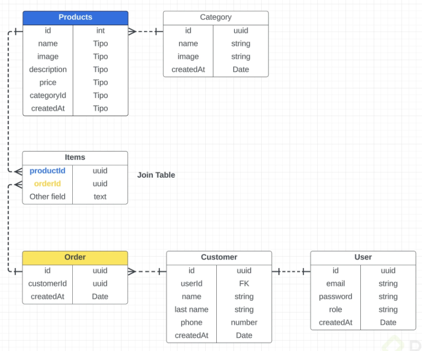
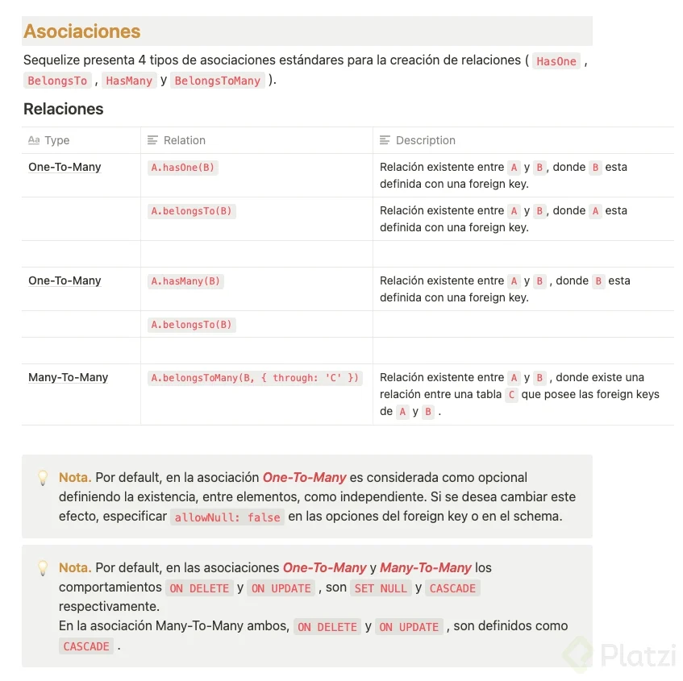

## Esquema de la base de datos:


### Serverless
💡Es un tipo de arquitectura que nos permite descentralizar los diferentes recursos existentes de nuestra aplicación.

. En ocasiones, a serverless se le denomina sistemas distribuidos ya que permite, abstraer desde servidores hasta módulos denominados cloud functions. . Una de las principales ventajas de implementar serverless es la creación de arquitecturas como cliente-servidor, micro-servicios, entre otros. .

Clean Architecture
💡Es un conjunto de principios cuya finalidad principal es ocultar los detalles de implementación a la lógica de dominio de la aplicación.

. Las principal característica de Clean Architecture frente a otras arquitecturas es la regla de dependencia. . En Clean Architecture, una aplicación se divide en responsabilidades y cada una de estas responsabilidades se representa en forma de capa. .

Definición de arquitectura
ℹ️Repositorio: https://github.com/roremdev/thingst ℹ️Commit: https://github.com/roremdev/thingst/commit/ead31629469e5a3b923efc42b8b8eb5b18159b97

libs - directorio de drivers connection.

Postgres.js

```js
import { Pool as PostgresClient } from 'pg';

export default class Postgres {
    /**
     * @private
     * @description singleton pattern for pool connection
     * @returns {object} - connection client
     */
    async #connect() {
        try {
            if (!Postgres.connection) {
                Postgres.connection = new PostgresClient();
                console.log('Connected succesfully');
            }
            return Postgres.connection;
        } catch (error) {
            console.log(error);
        }
    }
    /**
     * @description query process in table
     * @param {string} request - SQL string request
     * @returns {Object} - response query postgresDB
     */
    async query(request) {
        try {
            const db = await this.#connect();
            return await db.query(request);
        } catch (error) {
            console.log(error);
        }
    }
}
```
ℹ️Nota. Se utiliza Pool para el manejo de múltiples conexiones por usuario donde se delega la administrador por el servidor. .

services - directorio de controllers
.

Resource.js

```js
import Postgres from '../libs/Postgres';

export default class ResourcesService {
    /**
     * @description DAO postgresDB tables
     * @param {string} table - table name
     */
    constructor(table) {
        this.table = table;
        this.client = new Postgres();
    }

    /**
     * @description find all registers in table
     * @returns {array} - response query mongoDB as array
     */
    async findAll() {
        const { rows } = await this.client.query(`SELECT * FROM ${this.table}`);
        return rows;
    }
}
```

routes - endpoints definition

Resource.js

```js
import express from 'express';
import Resource from '../../services/Resource';

const router = express.Router();
const taskService = new Resource('tasks');

/**
 * @description get task operation
 * @param {string} path - express path
 * @param {callback} middleware - express generic middleware
 * @returns {ResponseObject}
 */
router.get('/', async (req, res, next) => {
    try {
        const data = await taskService.findAll();
        res.status(200).json({
            status: 'success',
            data,
            message: 'Retrieved all tasks',
        });
    } catch (error) {
        next(error);
    }
});

export default router;
```

-------
## comandos frecuentes:
| Comando                                        | Descripción                      |
|------------------------------------------------|----------------------------------|
| `docker-compose exec postgres bash`            | Conexión via terminal            |
| `ls -l`                                        | Ver todos los archivos           |
| `psql -h localhost -d <POSTGRES_DB> -U <POSTGRES_USER>` | Conexión a Postgres       |
| `\d+`                                          | Estructura de la base de datos   |
| `\q`                                           | Salir de la base de datos        |
| `exit`                                         | Salir del contenedor             |
| `docker-compose up -d pgadmin`                 | Levantar servicio de pgadmin     |
| `docker-ps`                                    | Tabla de servicios               |
| `docker-inspect <id>`                          | Detalle del contenedor           |


-------
# ORM

💡 **Un ORM** (Object-Relational Mapping) es un modelo de programación que permite mapear las estructuras de una base de datos relacional.

Al abstraer este tipo de programación, delegamos su implementación al backend, es decir, le añadimos una responsabilidad a la capa transaccional del servidor.

## ✨ Beneficios

- Acciones como CRUD (Create, Read, Update, Delete) son administradas mediante ORM.
- La implementación de seeds o semillas nos permite recuperar, mediante código, la estructura de una base de datos.
- Una de las bases teóricas para entender este modelo es mediante el conocimiento de DAO (Data Access Object) y DTO (Data Transfer Object), los cuales nos permiten desestructurar un ORM en módulos de abstracción para acceder a la base de datos y transferir datos desde la misma base de datos, respectivamente.

## 🙃 Contras

- Delegación de responsabilidades al servidor.
- Descentralización de trabajo, directa, de una base de datos.

------
Aquí tienes el texto con formato de markdown:

---

## Las migraciones son:

Las migraciones son la forma en que Django propaga cambios en los modelos y los refleja en el esquema de bases de datos.
- *Django*

Las migraciones son como un sistema de control de versiones para la base de datos.
- *Laravel*

Es como un sistema de control de versiones para manejar los cambios desde el código y trackear los cambios en la base de datos.
- *Sequelize*

Básicamente, las migraciones mantienen el historial del esquema que se lleva en la base de datos. Es un sistema muy usado en ambientes de producción para trackear los cambios sin tener que replicar todo nuevamente (creación de tablas, llaves foráneas, etc). Es decir, permite saber en qué punto estaba para saber qué es lo que se tiene que modificar.

---

