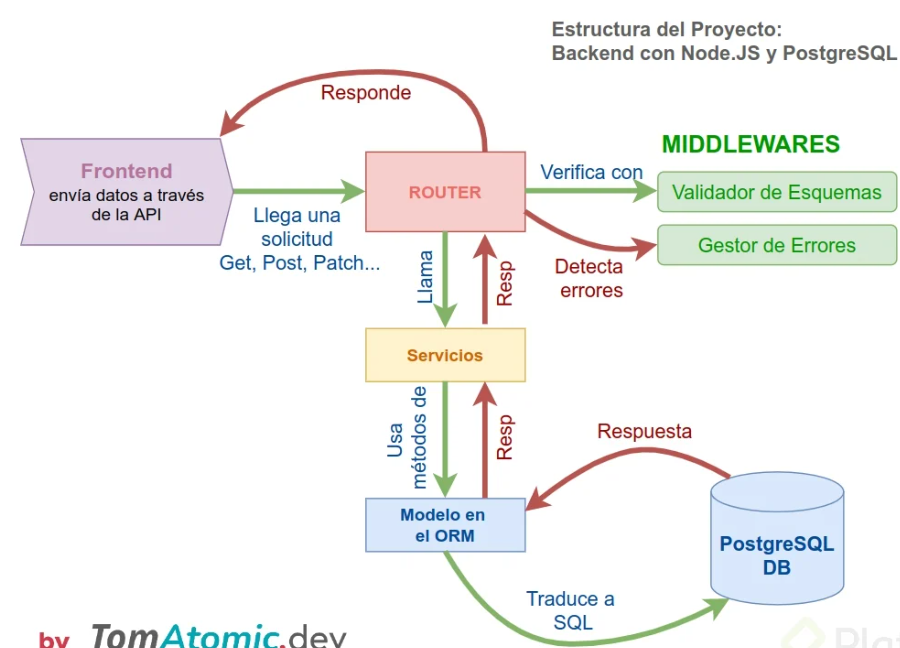

# ¿Cómo se está estructurando nuestro Proyecto?

Para entender mejor cómo funciona el flujo de operaciones dentro de nuestro Backend con Node JS observamos la siguiente imagen. Utilizamos Express.js para el routing, Sequelize como ORM y PostgreSQL como base de datos.

## En resumen:

1. El frontend envía datos a la API con un verbo HTTP.
2. El router (cuyas rutas de API diseñamos usando Express.js) recibe los datos y los verifica usando un Middleware de validación.
3. Si todo está bien, el router llama a los servicios.
4. Los servicios usan un método de POO incluido en la ORM para ejecutar una acción con la DB.
5. La ORM traduce a SQL para comunicarse con la DB.
6. La respuesta de la DB se propaga hasta llegar al router.
7. El router detecta si es un error y llama a un Middleware de gestión de errores (aquí usamos el paquete boom).
8. La respuesta, exitosa o de error, se envía como respuesta al Frontend.

¡Y así es como está funcionando nuestro backend hasta el momento!
